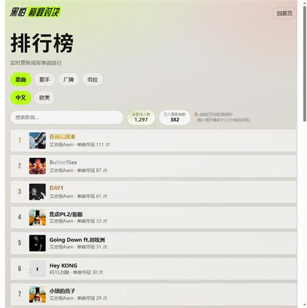
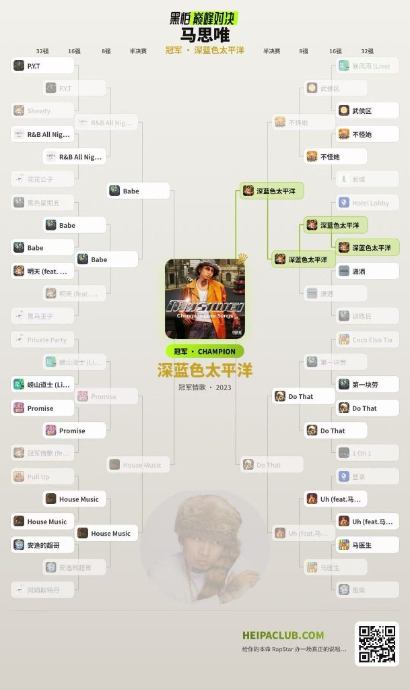

# 黑怕巅峰对决 · HeiPaClub

<p align="center">
  <strong>给你的本命 RapStar / Hit Song，办一场真正的说唱巅峰对决。</strong><br/>
  <a href="https://heipaclub.com/">heipaclub.com</a>
  ·
  免登录 · 可试听 · 可分享
</p>

<p align="center">
  <a href="https://heipaclub.com/"></a>
  <a href="https://github.com/yiziff/heipaclub"></a>
  
</p>

---

## Preview

| 实时冠军单曲榜 | 终场对阵分享图 |
|:---:|:---:|
|  |  |

> 左侧：全站匿名夺冠聚合，中文 / 欧美可切换，歌曲 · 歌手 · 厂牌 · 夯拉四榜同屏。  
> 右侧：一键生成专属对阵图，冠军路径高亮，适合截图发朋友圈。

玩法灵感特别鸣谢 [MusicCup.app](https://musiccup.app)。

---

## 现在能玩什么

| | 模式 | 一句话 |
|---|------|--------|
| 01 | **单曲 1v1** | 选中本命歌手，热门签表默认 32 强单败，一路点到冠军 |
| 02 | **自组 32 强** | 曲库扩到 Top 100 / 全部，再亲手勾正好 32 首开赛 |
| 03 | **厂牌巅峰混战** | 两大厂牌混抽对决；厂牌胜率榜 + 对阵明细 + 冠军单曲 |
| 04 | **锐评从夯到拉** | 随机抽 15 人，夯 / 顶级 / 人上人 / npc / 拉完了 —— 最夯榜 & 最拉榜同步累计 |
| 05 | **排行榜** | 实时冠军单曲、歌手、厂牌胜率、夯拉双列；日配额防刷 |

其它体验细节：

- **零账号** — 赛程落在本机 `localStorage`，刷新不丢
- **双源试听** — iTunes 预览优先，网易云兜底；冠军页封面角标再点开播放器
- **分享即海报** — Canvas 导出对阵图，带站点二维码与 slogan
- **热门秒开** — 高粉歌手走静态 Top 包；冷门先 KV（24h）再打实时接口

---

## 架构一览

```text
Browser  ──►  Cloudflare Worker · heipaclub
                 ├─ Vite Assets          静态前端
                 ├─ /api/rank/*          D1 · heipaclub-rank
                 ├─ /api/artist-top      KV · ARTIST_TOP（24h）
                 ├─ /api/netease/*       反代自建 api-enhanced
                 └─ /api/img             封面 CORS 代理
```

| 层 | 选型 |
|----|------|
| 前端 | Vite + 原生 JS（无重框架） |
| 边缘 | [`cf-api/index.js`](cf-api/index.js) · Wrangler |
| 曲库 | 自托管 [api-enhanced](https://github.com/NeteaseCloudMusicApiEnhanced/api-enhanced)（不可跑在 Workers 上） |

```text
heipaclub/
├─ src/                  主流程 · 排行榜 · 分享图 · 热门静态包
├─ src/data/hot-tops/    VIP / 常用歌手预打包 Top
├─ cf-api/               Rank / KV / 网易云反代 / 图片代理
├─ migrations/           D1 增量迁移（厂牌 · 夯拉 …）
├─ docs/screenshots/     README 示例图
├─ schema.sql            D1 全量表结构
└─ wrangler.jsonc        部署与绑定
```

---

## 本地启动

```bash
# 0 · Cloudflare + 密钥 + 本地 D1
npx wrangler login
cp .dev.vars.example .dev.vars          # Windows: copy .dev.vars.example .dev.vars
npm run db:init:local

# 1 · 网易云 API（另开终端）
cd ../api-enhanced && npm start

# 2 · 站点（含 Worker /api）
cd ../heipaclub && npm run dev
```

本机：http://127.0.0.1:5173  

路由速查：`#/` · `#/rank` · `#/label-beef` · `#/hangla`

| 命令 | 做什么 |
|------|--------|
| `npm run dev` | 本地开发 |
| `npm run deploy` | build + 推上 Cloudflare |
| `npm run hot-tops` | 重打热门静态包（需 api-enhanced） |
| `npm run roster` | 重建歌手名单 |
| `npm run db:init` / `db:init:local` | 初始化远程 / 本地 D1 |

---

## 排行榜与防刷

| 接口 | 作用 |
|------|------|
| `POST /api/rank/win` | 单曲 / 厂牌混战夺冠 +1 |
| `POST /api/rank/hangla` | 夯 / 拉完了计入 |
| `GET /api/rank/songs` · `artists` · `labels` · `hangla` | 各榜拉取 |
| `GET /api/rank/labels/:id/matchups` | 厂牌对阵明细（含冠军单曲） |
| `GET /api/rank/meta` | 汇总 |

原则：

- 不收集账号、不存完整签表；只聚合结果次数  
- **日配额**：Cookie ≈ 5 次 / 天；公网 IP ≈ 15 次 / 天（清 Cookie 兜底）  
- 前端同会话去重；身份以稳定 Cookie 为主（避免切 4G/Wi‑Fi 把限额打穿）

热门曲库加速链路：

1. 静态包 `src/data/hot-tops/` → 秒开  
2. KV `GET/PUT /api/artist-top` → 冷门 24h 记忆  
3. 实时 `/api/netease/artist/top/song` → 回写 KV  

开赛页还可「展开 Top 100 / 全部」→ `/artist/songs?order=hot` 分页补库。

---

## 部署

```bash
npm run deploy
```

首次上线 checklist：

1. D1：`npm run db:create` → 写入 `wrangler.jsonc` → `npm run db:init`（或跑 `migrations/`）  
2. KV：`ARTIST_TOP`（仓库已绑定）  
3. Secret：

```bash
npx wrangler secret put NETEASE_API_ORIGIN
# 例：https://ncm.example.com
```

自检：

- https://heipaclub.com/api/rank/meta  
- https://heipaclub.com/api/netease/search?keywords=法老&limit=1  

> `worker/` 是早期独立 Rank Worker，现已并入 `cf-api/`，一般不必再单独部署。

---

## 关于

线上点「关于本站」。作者：[yiziff](https://github.com/yiziff)。

**声明**：仅供学习与交流；曲库、试听与封面版权归原平台 / 权利人。玩法灵感致谢 [MusicCup](https://musiccup.app)。
